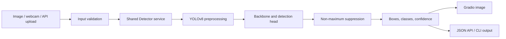

# YOLOv8 Object Detection System

[](https://github.com/ayushiiisinhaaa/Object-Detection-Model/actions/workflows/ci.yml)
[](https://www.python.org/)
[](LICENSE)
[](https://object-detection-model-navy.vercel.app)

A modular YOLOv8 inference system with a Gradio interface, FastAPI service,
batch CLI, dataset auditing, reproducible training, evaluation, tests, and Docker
support. It currently serves the official COCO-pretrained YOLOv8n baseline.

> **Project status:** custom training is not complete. No custom weights or
> custom-dataset metrics are claimed in this repository.

**Live application:** [object-detection-model-navy.vercel.app](https://object-detection-model-navy.vercel.app)

## Model status

| Component | Current state |
|---|---|
| Deployed model | Ultralytics YOLOv8n pretrained on COCO |
| Custom weights | Pending a reproducible training run |
| Validation metrics | Generated by `evaluate.py`; no custom results published yet |
| Interfaces | Gradio, REST API, and batch CLI |
| Quality gates | Ruff and pytest in GitHub Actions |

## Architecture



The model is initialized once per process. `src/object_detection/` owns inference
and configuration; UI and API modules only adapt inputs and outputs.

## Quick start

Python 3.11 is recommended.

```bash
python -m venv .venv
# Windows: .venv\Scripts\activate
# macOS/Linux: source .venv/bin/activate
python -m pip install -e ".[dev]"
```

Launch the Gradio UI:

```bash
python app.py
```

Run batch inference and save annotated images plus JSON detections:

```bash
python predict.py path/to/image-or-directory --output runs/predict
```

Start the API and open `http://localhost:8000/docs`:

```bash
uvicorn api:app --reload
curl -X POST http://localhost:8000/predict -F "file=@sample.jpg"
```

API endpoints:

| Method | Route | Purpose |
|---|---|---|
| `GET` | `/health` | Service health check |
| `POST` | `/predict` | JSON boxes, classes, scores, dimensions, and latency |

Uploads are restricted to JPEG, PNG, or WebP and a maximum of 10 MB.

## Configuration

| Environment variable | Default | Meaning |
|---|---:|---|
| `MODEL_PATH` | `yolov8n.pt` | Official model name or local checkpoint |
| `DEVICE` | `cpu` | Ultralytics device such as `cpu` or `0` |
| `CONFIDENCE` | `0.25` | Minimum confidence threshold |
| `IOU_THRESHOLD` | `0.70` | NMS IoU threshold |
| `IMAGE_SIZE` | `640` | Square inference size |

## Training workflow

1. Copy `configs/dataset.example.yaml` to `configs/dataset.yaml`.
2. Point it at separate train, validation, and test image directories.
3. Audit labels, normalized boxes, missing files, and cross-split duplicates.
4. Train with a fixed seed.
5. Evaluate `best.pt` on the held-out test split.

```bash
python audit_dataset.py --data configs/dataset.yaml
python train.py --data configs/dataset.yaml --device 0 --epochs 80
python evaluate.py --model runs/train/custom_yolov8n/weights/best.pt \
  --data configs/dataset.yaml --device 0
```

Evaluation writes `metrics.json`, per-class AP, speed measurements, a confusion
matrix, PR curves, and validation predictions under `runs/val/`.

## Results

Only measurements from a versioned, held-out split should replace this row:

| Model | Test split | mAP50 | mAP50-95 | Precision | Recall | Inference |
|---|---|---:|---:|---:|---:|---:|
| Custom model | Pending | - | - | - | - | - |

The intended experiment compares YOLOv8n with YOLOv8s to quantify the latency and
accuracy tradeoff. Hardware, thresholds, image size, dataset commit, and model
checksum must accompany the published numbers.

## Development

```bash
make lint
make test
```

Equivalent commands on Windows:

```powershell
python -m ruff check .
python -m pytest
```

Build and run the REST service in Docker:

```bash
docker build -t object-detection-api .
docker run --rm -p 8000:8000 object-detection-api
```

## Vercel deployment

The production deployment uses a compact ONNX Runtime function because the full
PyTorch/Ultralytics environment is larger than Vercel's serverless function
limit. The browser interface calls `vercel_api/index.py`, which applies the same
YOLOv8 preprocessing, confidence filtering, class-aware NMS, and JSON contract.
The local Gradio, training, and evaluation workflows continue to use Ultralytics.

```bash
npx vercel --prod
```

The committed `vercel_api/yolov8n.onnx` model is the 12.8 MB YOLOv8n export from
Kalray's Hugging Face repository. Its verified SHA-256 is
`65158dad735be799c2466fa15e260c09558080bd530b42a8d0c3d1b419afd8b5`.

## Repository layout

```text
src/object_detection/       shared settings and inference service
tests/                      unit and API contract tests
configs/                    versioned dataset configuration template
app.py                      Gradio UI
api.py                      FastAPI service
public/                     production browser interface
vercel_api/                 compact ONNX inference function
predict.py                  image and directory inference CLI
audit_dataset.py            label and split integrity checks
train.py                    deterministic training entry point
evaluate.py                 metrics and plot generation
training_experiment.ipynb   sanitized historical YOLOv5 experiment
```

## Design decisions

YOLOv8n is the baseline because its smaller compute and memory footprint suits
interactive CPU deployment. A larger model should replace it only if held-out
evaluation justifies the latency cost. The historical notebook combined wildlife
and miner data but reused training data for validation and did not complete a
valid run, so it is retained only as provenance rather than evidence.

## Limitations and next steps

- The current detector supports COCO categories, not the notebook's custom classes.
- A licensed, versioned dataset with isolated validation and test splits is required.
- Custom training metrics, qualitative samples, and failure analysis are pending.
- CPU/GPU benchmarks must be measured on named hardware before publication.
- A live demo should be deployed only after it uses the documented checkpoint.

See [MODEL_CARD.md](MODEL_CARD.md) for intended use and model limitations.

## Security

The original notebook output exposed a Kaggle token. Outputs are now cleared, but
the token must be revoked in Kaggle and purged from earlier Git history if the
repository was public while it was present. Never commit `kaggle.json`, weights,
datasets, or local environment files.

## License

Project code is available under the [MIT License](LICENSE). Ultralytics software
and model weights have separate licensing terms that must be reviewed before
commercial use.
